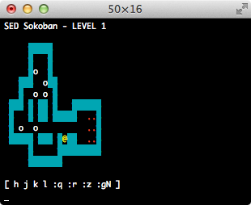

# Sokoban game implemented in sed

by [Aurelio Jargas][aurelio], 2003, 2004

The classic [Sokoban][] game implemented in [sed][], the UNIX stream editor.

- Portable sed script that works in Mac, Linux, BSD, Cygwin, …

- Read the [syntax highlighted code][hlcode]

- Watch the [gameplay video][video], by Yu-Jie Lin


## Instructions

Download the `sokoban.sed` file and run:

```console
$ sed -nf sokoban.sed
```

You need to press `Enter` twice. First to execute the command, then to feed sed with an input line. The main menu will appear:

```console
$ sed -nf sokoban.sed

Welcome to the SED Sokoban

Please select a level to begin [1-90]:
```

Now just type `1` for the first level, followed by an `Enter`.



Use the arrow keys or `j` `h` `k` `l` to move around. Remember to always press `Enter` after any movement, since sed is a **line** oriented editor. For example, to move up-left-left you must type: `↑`, `Enter`, `←`, `Enter`, `←`, `Enter`.

**It's cool because it's in sed. Don't expect an amazing gameplay :)**


[aurelio]: http://aurelio.net/aurelio/
[hlcode]: http://aurelio.net/projects/sedsokoban/sokoban.sed.html
[Sokoban]: http://en.wikipedia.org/wiki/Sokoban
[sed]: http://en.wikipedia.org/wiki/Sed
[video]: https://www.youtube.com/watch?v=bg3x43E-yjo
